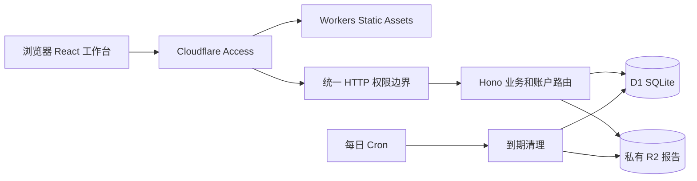

# 项目架构

核对日期：2026-10-01。本文说明实际实现；未实现的能力单列在最后。

## 1. 运行结构

同源部署：Vite 构建 `dist/`，Worker 提供 `/api/*`。静态页面由 Static Assets 提供，未知页面按单页应用回退；API 未匹配路由返回 JSON 404。`public/_headers` 仅控制静态响应，API 安全响应头由 `server/http.ts` 设置。

生产配置为 `wrangler.jsonc`；本地演示为 `wrangler.demo.jsonc`。生产、演示分别使用迁移链和资源，不能混用。Worker 入口同时导出 HTTP `fetch` 与定时任务 `scheduled`。

## 2. 模块边界

| 模块                                          | 责任                                         | 维护约束                           |
| --------------------------------------------- | -------------------------------------------- | ---------------------------------- |
| `shared/hearing.ts`                           | 历史频率、六个可编辑频率、空曲线、四频平均   | 纯函数，不依赖校验库、HTTP 或存储  |
| `shared/calendar.ts`                          | 北京时间业务日期、年龄、日期差、UTC 时间解析 | 业务日期与数据库时间戳分开         |
| `src/App.tsx`                                 | 壳、页组合、会话、数据集、编辑与跳转         | 独立图形和共用表单另有模块         |
| `src/IntakePage.tsx`                          | 同页客户建档                                 | 勾选部分一次提交，不分批建档       |
| `src/Audiogram.tsx` / `HearingEditor.tsx`     | 概览图与双耳交互图                           | 保留旧频率；新作图只操作六个频率   |
| `src/RecordEditor.tsx` / `Fields.tsx`         | 业务编辑与表单字段                           | UI 约束不能替代服务端验证          |
| `src/Accounts.tsx`                            | 账户、头像、门店、成员界面                   | 新登录账户只能后台提供             |
| `src/ServiceDirectory.tsx`                    | 设备、维修、保修跨客户查询                   | 跳转携带客户/记录/设备 ID          |
| `src/api.ts`                                  | 同源请求与当前标签页门店绑定                 | Cookie 仅是选择，不是授权          |
| `src/readPlan.ts` / `useWorkspaceData.ts`     | 页面读取需求与聚合摘要                       | 不预读无关目录；保持门店范围       |
| `src/useReadResource.ts` / `RecordPicker.tsx` | 当前页、位置游标、检索候选项与请求顺序       | 切店/退出后不得写回旧结果          |
| `src/useWorkspaceRoute.ts` / `workspace.ts`   | Hash 路由与展示规则                          | 地址不包含客户姓名和搜索文本       |
| `src/ui.tsx` / `WorkspaceSkeletons.tsx`       | 通用展示与对应页面骨架                       | 保留页面结构，仅替换未知数据       |
| `server/http.ts`                              | 来源、认证、大小、门店范围与错误处理         | 必须在所有路由前注册               |
| `server/auth.ts`                              | JWT 签名与提供者授权名单                     | 拒绝无配置、损坏配置和非店主身份   |
| `server/accounts.ts`                          | 全局个人资料、门店成员状态、初始引导         | D1 资料和成员不能授予登录资格      |
| `server/domain.ts`                            | Zod 输入验证                                 | 写入前验证；听力计算复用 shared    |
| `server/index.ts`                             | 客户、业务、附件路由及 Worker 入口           | 所有读写限定已验证门店             |
| `server/read-model.ts` / `pagination.ts`      | SQL 列表、筛选、游标与聚合                   | LIMIT 有上限；保留父记录隔离       |
| `server/exports.ts`                           | JSON 与离线表格快照                          | 当前门店；Excel 排除软删除         |
| `server/retention.ts`                         | 30 天保留与附件清理                          | 先删文件，成功后删目录；失败可重试 |

浏览器只导入纯规则，**不加载服务端 Zod 校验模块**；服务器仍独立验证所有写入。环境绑定类型集中于 `server/types.ts`。

## 3. 登录与门店选择

生产 API 实际中间件顺序为：

1. 设置禁止缓存等响应头；写请求检查同源 `Origin` 和 `X-Requested-With`。
2. 校验 Access JWT 的 RS256 签名、issuer、audience、有效期和必需声明。
3. 验证 JWT 邮箱在运行时 `STAFF_ACCOUNTS` 中，身份为店主。
4. 读取 D1 个人资料，必要时引导初始资料和门店。初始同店成员用 JSON 批量 SQL 引导，固定四条批处理语句，避免随人数增加耗尽免费查询数。
5. 依据 `X-Hearing-Store`（下载支持 `store` 参数）或新页面选择 Cookie，检查门店及成员启用/保留状态。
6. 限制请求大小，再验证无门店账户不能访问客户业务接口；生产业务写入必须显式绑定门店。
7. 业务处理继续校验客户、记录和关联设备归属，执行参数化 SQL。

登录、配置、退出有明确例外。退出在提供者已撤权时仍可清除 Cookie，但受生产来源检查。

Cookie 记住下次打开页面的门店。前端读取 `/api/me` 后把门店绑定到当前标签页，后续 API 显式发送门店；另一标签页切店不会让本页资料写进另一家店。显式传入无权门店时拒绝，不悄悄切到别家。

个人姓名/头像全局唯一，只本人修改；门店名称由该门店店主修改。同店所有有效店主权限相同，没有前台、验配师、单位、收费或公开注册。详细状态规则见 [安全说明](SECURITY.md) 与 [运行维护](OPERATIONS.md)。

## 4. 页面与渐进加载

Hash 地址例如 `#page=customers&customer=<id>&tab=<标签>&record=<id>`，可带 `device` 定位维修设备；支持前进/返回/刷新。

应用开始即按地址渲染对应页面。身份读取期间壳处于 `inert`，不能提交尚未确定权限的操作。身份读取后，按所在页面请求相应的一页客户/随访/设备/维修/回收站以及聚合摘要，拥有 `loading/ready/error` 状态；哪个资源返回就更新相关区域。客户详情独立按 ID 读取，表单候选项按需检索。账户页门店和成员也独立加载。没有用于展示“进度”的人为延迟；完整规则见 [数据加载](DATA-LOADING.md)。

静态标题、按钮、字段名和图轴先展示，未知内容显示骨架；骨架复用实际 CSS 与听力编辑器结构。失败区域提供重试，已就绪区域保持可用。`prefers-reduced-motion` 关闭扫光与出现动效。

表单草稿只在页面内存中，离开有未保存提示；没有长期草稿或自动写入重试。当前没有请求幂等键和编辑版本比较，同一记录并发编辑可能由后保存的内容覆盖先保存的内容。

## 5. 数据与时间

业务表均带 `tenant_id`，表示门店 ID，不是单位。报告原件独立存在 R2；关系与字段见 [数据模型](DATA-MODEL.md)。检查、验配采用受验证 JSON 快照，维修、随访采用字段。同页建档与审计使用 D1 `batch` 一次提交。

生日、验配、保修、预约为无时区的 `YYYY-MM-DD`；“今天”统一按 `Asia/Shanghai`。D1 `CURRENT_TIMESTAMP` 为 UTC，界面转换为北京时间。恢复期限是实际经过的 30 × 24 小时；Cron 在北京时间 02:00。过期即拒绝恢复，物理清理可能因日调度、积压或失败晚于截止时刻。

附件先写 R2，再写目录和审计；D1 失败尝试补偿删除对象。D1/R2 没有跨服务原子事务，补偿也可能失败。完整备份须停写、复制 SQL 和报告并核对，见 [备份恢复](BACKUP.md)。

## 6. 样式和构建

样式顺序固定为 `style.css → cloudflare.css → ui-theme.css → hearing-editor.css → workspace.css`。历史样式仍保留，最终中性主题与布局主要由后几个文件控制；此次保留已验收外观。新增样式优先放组件文件或 `workspace.css`，避免增加更晚的全局覆盖链。

锁文件固定依赖，环境为 Node 24 / pnpm 11.19.0。`pnpm check` 校验文档链接、回归测试、类型与构建；生产 Builds 从 main 配置、检查、应用正式迁移，再发布。员工 Secret 不由仓库生成。

## 7. 更换服务商

1. 完整备份 SQL、文件、校验清单、代码版本及受保护配置。
2. 保留 `shared/` 和大部分 React/Hono 业务，为新平台提供运行入口和身份验证适配。
3. 适配 `env.DB` 的 prepare/bind/first/all/batch；当前没有通用仓储接口。SQLite 可复用大部分结构，PostgreSQL/MySQL 需转换 SQL 方言、JSON 查询及批处理。
4. 适配 `env.FILES` 私有存储并保留对象键关系，不能因迁移而公开报告。
5. 同源部署可复用客户端。跨域或桌面/移动客户端需新的认证和 API 版本策略，不能简单放开 CORS。
6. 核对数据、成员、文件和隔离测试，安排最后停写同步、切换和回退窗口。

迁移能复用业务代码，但不是零修改。

## 8. 当前边界

列表已采用服务端游标，统计使用 D1 聚合。单客历史详情及主动导出仍完整读取，搜索使用 LIKE（D1 模式最多 50 字节），包含检索和精确统计仍可能扫描本门店的相关记录。没有自动异地备份、监控告警平台、写入版本、仪器/批量客户导入或自动通知。历史 JSON 数据边界仍有宽类型，后续扩展应逐步收紧。没有库存系统。

规模增长时依据实际 D1 指标优化查询，再考虑并发写入保护和备份自动化；不为未来规模提前分片或更换数据库。
