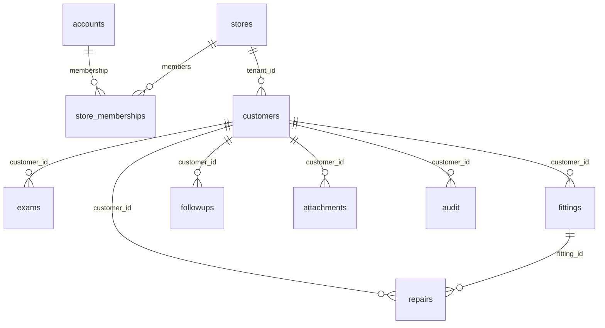

# 数据模型与生命周期

核对日期：2026-10-01。实际结构由 `migrations-production/0001_initial.sql` 至 `0008_paged_read_indexes.sql` 累积产生。本地演示迁移链独立存在。

## 1. 关系



图表示业务关系，不表示每条线都是数据库外键。`customers.tenant_id` 没有外键到 stores；成员 email 没有外键到 accounts；audit.customer_id 没有外键。门店范围和关联归属必须由服务端 SQL 验证，不能仅依靠 SQLite 的单列外键。

## 2. 表及主要字段

| 表                                            | 主键/范围                              | 内容                                                                                                                                              |
| --------------------------------------------- | -------------------------------------- | ------------------------------------------------------------------------------------------------------------------------------------------------- |
| accounts                                      | email（不区分大小写）                  | 全局姓名 name、头像 avatar、updated_at；旧 tenant_id/store_name/enabled/source 为兼容历史保留                                                     |
| stores                                        | id                                     | name、created_at、deleted_at、abandoned_at                                                                                                        |
| store_memberships                             | email + tenant_id                      | enabled、left_at、last_seen_at、source；历史 name/avatar 保留，不是个人资料主来源                                                                 |
| customers                                     | id + tenant_id 范围                    | name、gender、birth_date、phone、contact、contact_phone、address、source、status、history、needs、created_at、deleted_at                          |
| exams                                         | id、tenant_id、customer_id             | date、JSON data、created_at、deleted_at                                                                                                           |
| fittings                                      | id、tenant_id、customer_id             | date、JSON data、created_at、deleted_at                                                                                                           |
| repairs                                       | id、tenant_id、customer_id、fitting_id | occurred_date、received_date、completed_date、status、problem、findings、work_done、parts、price、warranty_covered、notes、created_at、deleted_at |
| followups                                     | id、tenant_id、customer_id             | due、type、note、completed、result、completed_at、deleted_at；没有 created_at                                                                     |
| attachments                                   | id、tenant_id、customer_id             | name、mime、size、object_key、created_at、deleted_at；不存报告字节                                                                                |
| audit                                         | id、tenant_id                          | actor、action、customer_id（门店管理事件可为空）、created_at                                                                                      |
| sessions                                      | token                                  | 仅本地演示登录，role、tenant_id、expires_at（毫秒）                                                                                               |
| device_brands / device_series / device_models | id + tenant_id                         | 已停用的历史字典兼容表，无网站操作接口；门店清理时按依赖顺序清理                                                                                  |
| d1_migrations                                 | Wrangler 管理                          | 已执行迁移清单；不要手工随意改写                                                                                                                  |

生产授权来源是 Access + STAFF_ACCOUNTS + 当前门店成员资格，**不是 accounts.enabled 或 accounts.source**。从后台名单移除邮箱会使现有数据库行也不能继续登录；数据库资料本身不授予账户资格。

## 3. JSON 快照

检查 `data`：

```json
{
  "date": "2026-09-30",
  "right": [{ "frequency": 125, "value": null, "masked": false, "noResponse": false }],
  "left": [],
  "boneRight": [],
  "boneLeft": [],
  "speech": "",
  "other": "",
  "conclusion": ""
}
```

上面仅说明字段，不是可直接提交的检查：四条必需曲线各有 **11 个不重复频率点**，完整频率为 125、250、500、750、1000、1500、2000、3000、4000、6000、8000 Hz。可选 uclRight/uclLeft 也各为 11 点；UI 只修改 250、500、1000、2000、4000、8000 Hz，其他历史频率保留。value 为 null 或 -10 至 120 dB HL；noResponse 为 true 必须有数值。新图操作按 5 dB 对齐，服务器也兼容历史非 5 dB 数值。

四频平均只取气导 500、1000、2000、4000 Hz；任何缺测或无反应返回 null，不替代临床诊断。

验配 `data`：date、brand、series、model、side、serialLeft、serialRight、amount、warranty、notes。server/domain.ts 根据耳侧清空不适用的序列号，并产生兼容 serial 展示串。两个已填序列号不允许忽略大小写后相同；当前没有跨记录/跨门店序列号唯一索引，允许记录同一设备历次验配。型号无需字典，可以留空。

金额按元、非负 number 保存（维修 price 为 SQLite REAL），最大 10000000；不是财务账本，没有税务或付款状态。若未来加入财务计算，应新增整数分字段和兼容迁移，不能直接变更已有金额单位。

## 4. 删除和恢复

| 操作                         | 立即效果                                         | 30 天内恢复                                  | 到期效果                             |
| ---------------------------- | ------------------------------------------------ | -------------------------------------------- | ------------------------------------ |
| 删除客户                     | 普通查询、搜索、业务/文件访问隐藏整个档案        | 回收站恢复客户，原有效子记录重新可见         | 清理附件、业务、客户及关联审计       |
| 删除检查/验配/随访/维修/附件 | 对应记录隐藏                                     | 客户页恢复；客户必须有效，维修还要求设备有效 | 清理该记录；到期验配同时清理相关维修 |
| 退出门店                     | 本人 enabled=0、记录 left_at；立即无该店访问资格 | 本人可恢复加入；其他有效店主可撤销恢复资格   | 不再可自行恢复，需店主重新添加       |
| 店主停用成员                 | enabled=0、left_at 清空                          | 本人不可自行恢复；其他店主可重新启用         | 与主动退出规则不同                   |
| 删除门店                     | deleted_at 标记；全部成员不能进入                | 原有效成员可恢复门店                         | 清理该门店资料，保留小型墓碑         |
| 门店失去所有有效成员         | abandoned_at 标记                                | 合法恢复加入时清空标记                       | 无人管理满 30 天后清理，不另加 30 天 |

有效成员还必须存在于提供者店主名单。缺失/损坏后台名单不会被解释成空名单来新标记无人门店。主动退出或停用的成员墓碑用于防止旧初始配置自动重新添加。

截止时间使用 UTC 删除时间 + 30 × 24 小时。恢复 SQL 再检查期限、父记录/成员状态，避免预查询后状态变化仍恢复；失败可为 404 或 409。定时任务每天北京时间 02:00，最多处理 500 个报告对象；积压或失败时物理删除延后，但过期恢复已被拒绝。

清理先删除 R2 对象再删附件目录。存在未清理附件时保留父客户，以便下一次尝试。账户个人资料不随门店删除。旧备份不受线上 Cron 管理，见 [备份说明](BACKUP.md)。

## 5. 文件与审计

R2 对象键为 `门店ID/客户ID/附件UUID`；原文件名仅存在目录，用于下载。桶无公开 URL。头像裁切压缩为小型 data URL 后存在 accounts.avatar，不占 R2；不是原头像文件备份。

审计记录具体操作人姓名与邮箱、动作、客户和时间；当前不保存修改前后的字段快照，也不是不可篡改日志。仍有效客户保留审计；彻底清理档案/门店时清除对应审计。

## 6. 导出与备份区别

- 核心 Excel：已验配/未验配客户两表，一客一行，包含本人/亲属联系方式、住址、历次有效设备型号和左右耳序列号；不导出年龄列。
- 业务 Excel：含同样两客户表，加每位客户最新一次听力数据、所有有效验配、维修和随访；每表带客户姓名与编号，不导出报告、曲线图片及全部备注。
- JSON：当前门店业务全表，含软删除和旧字典、审计，但不包含 accounts/stores/memberships、文件或 Secret；没有 JSON 导入恢复接口。
- 完整备份：D1 SQL 包含所有门店/成员和迁移历史，配套 R2 原件、校验清单；Secret 和 Access 配置另行加密保存。

## 7. 迁移维护

禁止改写已经部署的迁移，新增变更要分别追加正式与演示迁移。正式库不运行 Demo seed。索引覆盖 tenant、customer、due、deleted_at、设备关联，以及新游标所需的复合排序、客户阶段和保修/维修表达式。已实现服务端分页/聚合，未引入全文索引；新增索引用途及成本见 [数据加载](DATA-LOADING.md)。

跨服务商迁移必须保留门店 ID、账户 email、成员状态、客户/设备/维修关系、软删除时间及对象键。恢复旧备份可能重新出现已删除资料，应停写核对后再开放访问。
